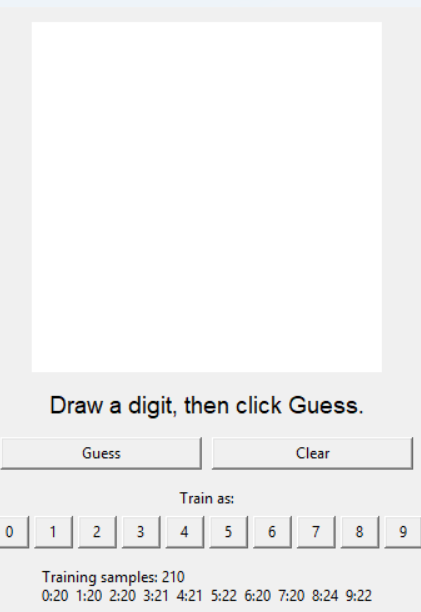
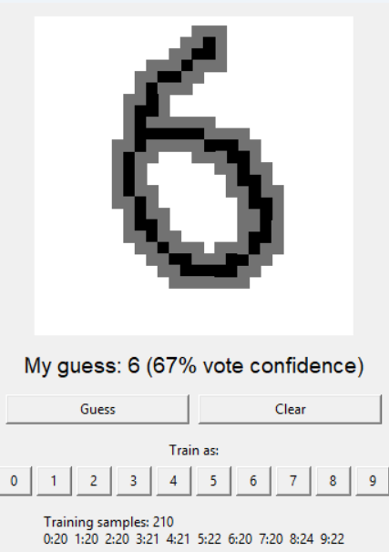
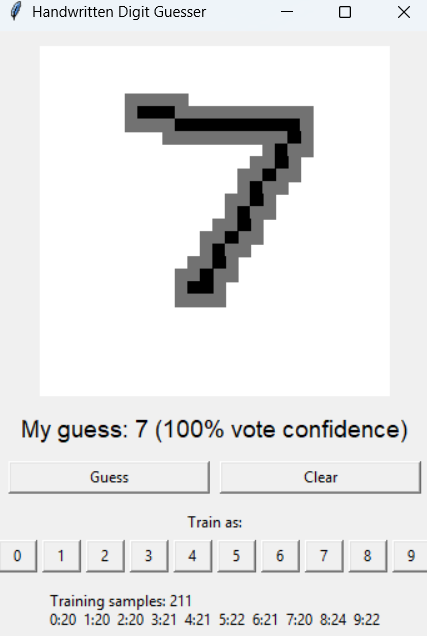
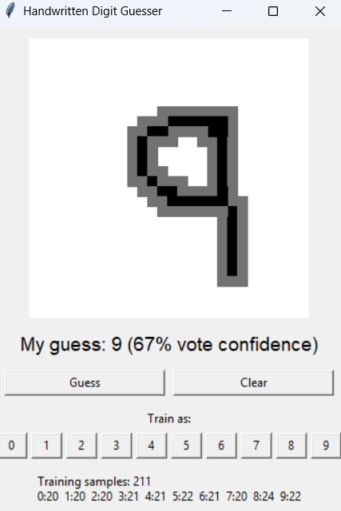
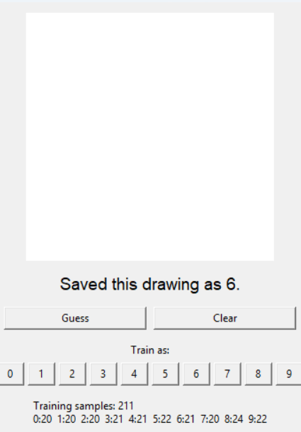

# Visual Digits

A silly small Python app made in VS Code that guesses handwritten digits from 0 to 9.

The app uses a simple manually trained dataset, NOT MNIST. You draw a digit, tell the app what digit it is, and it saves that example. After enough examples are trained, the app can guess new drawings.

## Screenshots

Blank app screen:



Guessing a 6:



Guessing a 7:



Guessing a 9:



Training a 6:



## Features

- Draw digits with the mouse
- Guess digits from 0 to 9
- Manually train the app by approving the correct digit
- Saves training data locally in `digit_data.json`
- Built with Python and Tkinter
- No machine learning library required

## Platform Support

| Platform | Status | Notes |
| --- | --- | --- |
| Windows 10/11 | Supported | Best tested platform ( cuz i use it lol ). Run with Python from Terminal, PowerShell, or VS Code. |
| macOS | Supported | Works with Python 3 and Tkinter. See the macOS Gatekeeper section below if macOS blocks the app. |
| Linux | Supported | Works with Python 3. BUT you might have to install tkinter seperately  |

## Files

1. `main.py` - the GUI app
2. `training.py` - training and prediction logic
3. `digit_data.json` - training dataset
4. `main-tr.py` - the GUI app + training feature

If you want to add more data excluding the already 102 samples, use `main-tr.py`.

## Requirements

1. Computer (🥀🥀🤧)
2. Python
3. Tkinter, which is usually included with Python

## Install Instructions

### Windows

1. Install Python from [python.org](https://www.python.org/downloads/).
2. During install, enable `Add python.exe to PATH`.
3. Download or clone this project.
4. Open PowerShell or Terminal in the project folder.
5. Run:

```bash
python main.py
```

IF you feel like also training the data( for fun/serious purposes ) , run:

```bash
python main-tr.py
```

### macOS

1. Install Python 3 from [python.org](https://www.python.org/downloads/macos/) or with Homebrew:

```bash
brew install python
```

2. Download or clone this project.
3. Open Terminal in the project folder.
4. Run:

```bash
python3 main.py
```

IF you feel like also training the data ( for fun/serious purposes ), run:

```bash
python3 main-tr.py
```

### Linux

1. Install Python 3.
2. Install Tkinter if your distro does not include it.

Ubuntu/Debian:

```bash
sudo apt install python3 python3-tk
```

Fedora:

```bash
sudo dnf install python3 python3-tkinter
```

Arch:

```bash
sudo pacman -S python tk
```

3. Open a terminal in the project folder and run:

```bash
python3 main.py
```

IF you feel like also training the data( for fun/serious purposes ), run:

```bash
python3 main-tr.py
```

## How to Run

Open a terminal in the project folder and run:

```bash
python main.py
```

On macOS or Linux, use this if `python` does not work:

```bash
python3 main.py
```

## Training Your Dataset

1. Run `main-tr.py`.
2. Draw a digit in the white box.
3. Click the correct digit button under `Train as`.
4. Repeat this many times for digits 0 to 9.

The app will save your examples into `digit_data.json`.

For better results, train each digit multiple times.

NOTE: the only difference between `main.py` and `main-tr.py` is that `main-tr.py` also has the additional training feature, so I suggest you download `main-tr.py` instead of `main.py` if you feel like training it yourself!!

Currently it only contains 212 samples in the original training note, but this can change as `digit_data.json` gets updated.

## How It Works

The drawing is converted into a small 28 x 28 grid of pixels. When you click a training button, the app saves that grid with the correct digit label.

When guessing, the app compares your new drawing with the saved examples and chooses the closest matching digit.

## macOS Gatekeeper 

The easiest way to avoid Gatekeeper confusion is to launch it from Terminal instead of double-clicking it.

Use:

```bash
python3 main.py
```

If macOS says the file or app cannot be opened because it is from an unidentified developer:

1. Make sure you downloaded the project from the GitHub repository(main file , training file and the dataset json)
2. Open Terminal.
3. `cd` into the project folder.
4. Run `python3 main.py` 

For a guess-only version, use `main.py`. For a trainable+guess version, use `main-tr.py`.

This is a beginner-friendly digit guesser. It is not meant to be as accurate as a real neural network/CNN model, but it is easy to understand, edit, and train manually.
